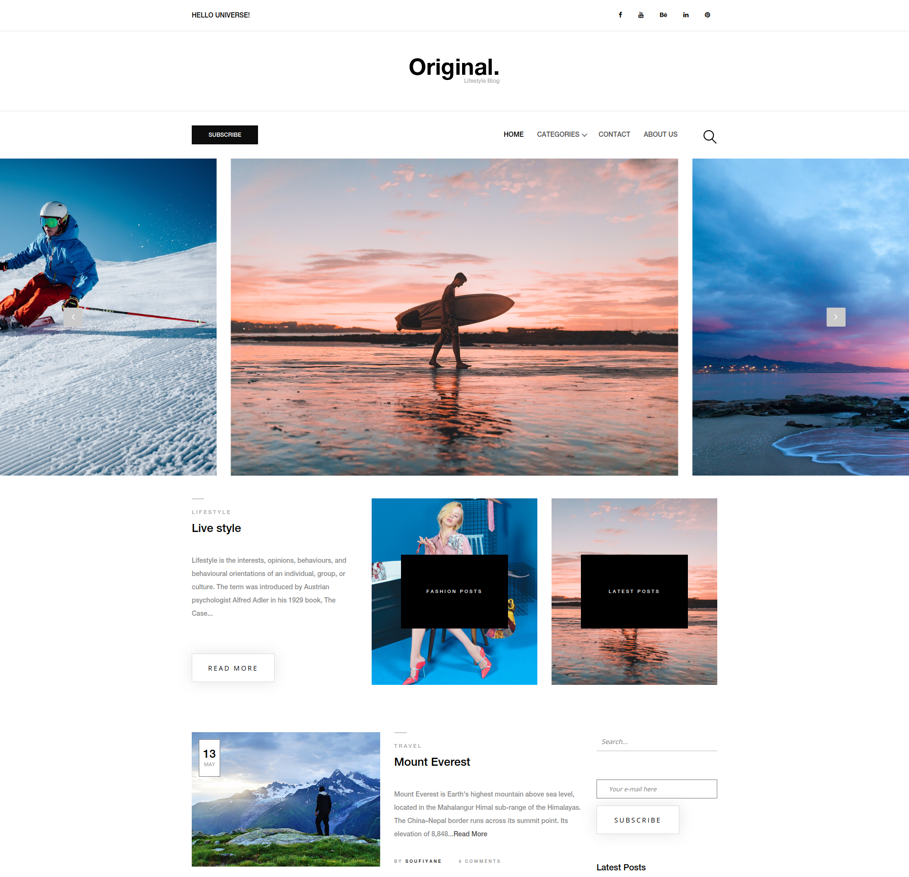
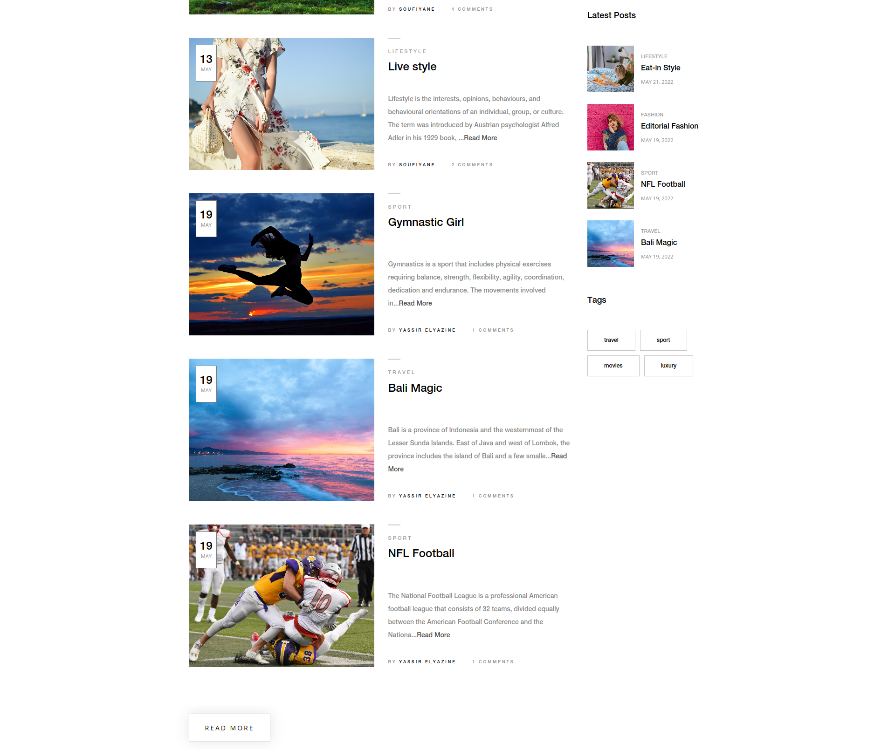
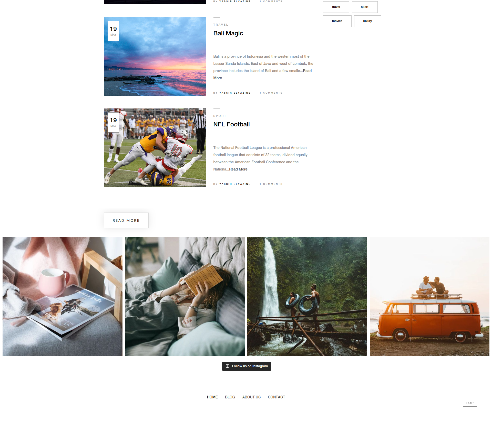

# Yinas WordPress Blog Theme

Yinas is a meticulously crafted WordPress blog theme that offers unparalleled customization options with ACF (Advanced Custom Fields). With its flexible design, admins can easily manipulate the layout, choose what content to display or hide, and create truly unique and personalized websites. Empowering bloggers to reflect their individuality.

## Table of Contents

- [Installation](#installation)
- [Usage](#usage)
- [Customization](#customization)
- [Theme Showcase](#theme-showcase)
- [Contributing](#contributing)

## Installation

To use the Yinas WordPress Blog Theme, follow these steps:

1. **Clone the Repository**: Clone this repository to your WordPress themes directory.
   ```bash
   git clone https://github.com/soufiiyane/Yinas.git
   ```

2. **Activate the Theme**: Log in to your WordPress admin panel, navigate to "Appearance," and activate the Yinas theme.

3. **Customize**: Customize the theme settings and appearance to match your blog's style and content.

4. **Start Blogging**: Start creating and publishing your blog posts with the flexibility and unique features offered by Yinas.

## Usage

Yinas is designed to make your blogging experience enjoyable and flexible. Here are some key features and tips for using the theme effectively:

- **Customization**: Use Advanced Custom Fields (ACF) to tailor the theme to your specific needs. You can easily manipulate the layout, choose what content to display or hide, and create a unique website.

- **Blog Posts**: Create and publish your blog posts with ease. Yinas provides a user-friendly interface for managing your content.

- **Categories and Tags**: Organize your blog posts using categories and tags for better navigation and SEO optimization.

- **Widgets**: Take advantage of the included sidebar widgets, such as archives, contact information, and post-related content.

## Customization

Yinas is highly customizable to suit your individual needs. You can customize various aspects of the theme, including:

- **Colors and Fonts**: Adjust the color scheme and typography to match your brand or personal style.

- **Layout**: Modify the layout of your blog pages to showcase your content in the way you prefer.

- **Header and Footer**: Customize the header and footer sections to include your logo, navigation, and other relevant information.

## Theme Showcase
Here's how the Yinas theme looks in action:

<!-- Add images side by side -->
<div align="center">
    
    
    
</div>

## Contributing

If you'd like to contribute, please follow these steps:

1. Fork the repository.

2. Create a new branch for your feature or bug fix.

3. Make your changes and test them thoroughly.

4. Create a pull request explaining your changes and why they are beneficial.

5. I will review your pull request and work with you to merge it into the main codebase.
